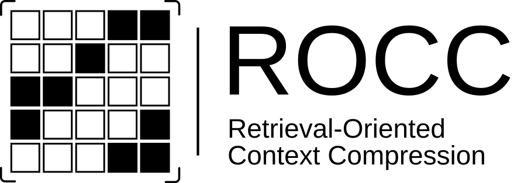
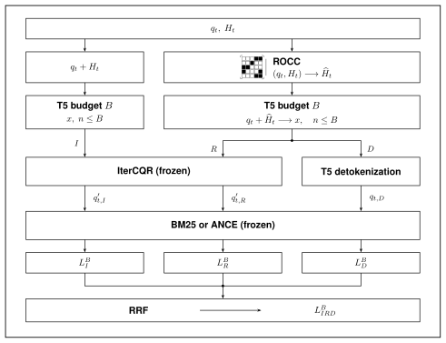
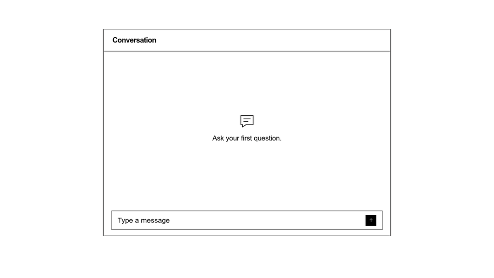

# ROCC



Conversational search brings information retrieval into an ongoing dialogue. Queries are often incomplete or ambiguous because they refer to earlier turns, while topic changes can make older context irrelevant. Query rewriters use the conversation history to turn these queries into standalone search queries.

However, rewriting adds latency. Irrelevant details and competing topics can also lead to unsupported additions, and the generated query does not directly reveal which parts of the history influenced it.

ROCC selects relevant words from previous questions and answers for the current query. The selected text remains traceable to the original conversation. In the **R route**, this shorter history supports rewriting with less context to process. In the **D route**, the current query and selected history go directly to the retriever, without a generative rewrite. Rank fusion can combine these complementary retrieval results for further gains.



This repository provides the trained ROCC model for use in your own system and the original notebooks and scripts to reproduce the experiments.

## Selection example



[View full size](assets/rocc-animation.gif)

The base ROCC model keeps two earlier answers (13 words), which identify and describe the organization referred to by “their”. The current query remains unchanged and is passed to the next stage with only this selected history. See the [explanation notebook](experiments/09_explainability.ipynb).

## Install

Linux and Python 3.12 are the tested environment. Install Git and Git LFS first. The complete ROCC model, including encoder, classifier and CRF, is included through Git LFS. It is about 134 MB.

```bash
git lfs install
git clone https://github.com/lazur2006/ROCC.git
cd ROCC
git lfs pull
python3.12 -m venv .venv
source .venv/bin/activate
python -m pip install torch==2.11.0 --index-url https://download.pytorch.org/whl/cpu
python -m pip install -e .
```

The CPU installation is sufficient for ROCC inference. For GPU experiments, install the PyTorch build appropriate for your hardware instead. Dependencies are specified in `pyproject.toml`.

## 1. Use ROCC

Run this example from the repository directory. It uses the original inference functions and loads only the supplied local model files. No dataset, search index, IterCQR model or API key is needed.

```python
from pathlib import Path
import torch
from transformers import AutoConfig, AutoModel, AutoTokenizer
from experiments.rocc.history_selector import (
    EncoderCrfHistorySelector, HistorySelectorConfig, predict_selected_histories,
)

assets = Path("models/rocc")
device = torch.device("cpu")
state = torch.load(assets / "model.pt", map_location="cpu", weights_only=True)
encoder = AutoModel.from_config(
    AutoConfig.from_pretrained(assets, local_files_only=True),
    trust_remote_code=False,
)
model = EncoderCrfHistorySelector(
    str(assets), num_labels=3, encoder=encoder,
    class_weights=state["class_weights"].tolist(),
    crf_loss_weight=1.0, token_loss_weight=1.0,
)
model.load_state_dict(state, strict=True)
model.to(device).eval()
tokenizer = AutoTokenizer.from_pretrained(assets, local_files_only=True, use_fast=True)

rows = [{
    "sample_id": "example",
    "current_query": "Where was he born?",
    "history": [{
        "turn_id": 1,
        "question": "Who was Albert Einstein?",
        "answer": "Albert Einstein was a theoretical physicist.",
    }],
}]
selected = predict_selected_histories(
    rows, model=model, tokenizer=tokenizer, device=device,
    label_space="collapsed",
    config=HistorySelectorConfig(max_length=512, history_order="recent_first"),
    batch_size=16, progress=False,
)
print(selected["example"])
```

Give every conversation a unique `sample_id`. The output contains selected original history text, not a generated answer. Apply any input budget required by your downstream rewriter or retriever separately.

## 2. Reproduce the experiments

> **Teacher labels are available on Google Drive.** Use the [original train and dev labels](https://drive.google.com/drive/folders/1edPjgKcEJpIhwcb33LUK6iWnUvNj56Ae) to reproduce the experiments without new, paid teacher API calls. See [Teacher labels](#teacher-labels) below for setup. They are not needed just to use ROCC.

The 14 notebooks are in `experiments/`, beside their `rocc/` package and the supporting `scripts/`. Run the experiments to compute your own results. The notebooks display their tables and figures directly; NB10 summarizes the additional efficiency measurements.

```bash
python -m pip install -e '.[experiments]'
python -m spacy download en_core_web_sm
# Install Java 21 with your operating system's package manager.
# Adjust this path if your Java 21 installation is elsewhere.
export JAVA_HOME=/usr/lib/jvm/java-21-openjdk-amd64
export PATH="$JAVA_HOME/bin:$PATH"
java -version
export MASTER_THESIS_PROJECT_ROOT="$PWD"
export PYTHONPATH="$PWD/experiments${PYTHONPATH:+:$PYTHONPATH}"
export ROCC_LINEAGE=local
jupyter lab experiments
```

`ROCC_LINEAGE=local` identifies a new experiment chain from your own upstream files. Historical hashes remain available when this setting is absent. New teacher responses or training runs can produce different results. The original checks on the selected architecture and fusion configuration remain active and stop a run that no longer matches that protocol. Do not mix old intermediate results with a new run.

### IterCQR

Download the **TopiOCQA IterCQR checkpoint** from the [authors' model folder](https://drive.google.com/drive/folders/1i3Hw0dmUPWkny8OUbgko8IgANhl7b9St), linked in the [official IterCQR repository](https://github.com/YunahJang/IterCQR). Put its `config.json`, `generation_config.json`, `pytorch_model.bin`, `special_tokens_map.json`, `spiece.model` and `tokenizer_config.json` directly in `experiments/model/IterCQR/IterCQR Model/`. Base T5 is not a substitute. IterCQR is not needed for use case 1.

### Teacher labels

Download the original **TopiOCQA train and dev teacher labels** and their two `.manifest.json` files from the [teacher-label folder](https://drive.google.com/drive/folders/1edPjgKcEJpIhwcb33LUK6iWnUvNj56Ae). Put all four files directly in `experiments/results/04_teacher/`. Train contains 38,432 labeled queries (346 MB), dev contains 2,104 (18 MB). The manifests contain the file checksums and annotation settings. These are training and evaluation inputs, not precomputed retrieval results.

Run NB04 with its `RUN_*` flags enabled and `ALLOW_TEACHER_API=False`. It reuses the labels, extracts its 600-query diagnostic subset from train, and runs the retrieval comparison. No teacher API credentials or paid requests are needed. NB05 then trains the selector from these labels.

To generate labels instead, start from a fresh checkout without downloaded labels, set `AZURE_OPENAI_ENDPOINT` and `AZURE_OPENAI_API_KEY`, configure your deployment in NB04, and explicitly set `ALLOW_TEACHER_API=True`. This incurs API charges and can produce different labels. No credentials are supplied.

NB08 automatically downloads the two public DQ-CIS result files, about 146 MB together, and verifies their checksums. Its first run needs internet access unless these files are already in the notebook's cache. No DQ-CIS model is required.

### Build or download the indices

For a full rebuild, start with NB00a for QReCC and NB00b for TopiOCQA. Public datasets are downloaded by the setup code when absent. Enable `REBUILD_QRECC_BM25_INDEX` / `START_QRECC_ANCE_RANGE_BUILD` in NB00a and `REBUILD_TOPIOCQA_BM25_INDEX` / `START_TOPIOCQA_ANCE_BUILD` in NB00b for the indices you want to construct.

These are large jobs. The four completed indices alone occupy about 378 GB, before corpora, temporary files, model downloads and experiment outputs. Canonical ANCE retrieval uses CUDA and float32. One QReCC half-index needs about **78.1 GiB of GPU memory plus the 4 GiB reserve**; an 80 GB GPU is insufficient for that unchanged setting. TopiOCQA needs about 73.5 GiB plus the reserve. CPU-only ROCC inference has no such requirement. Two small corpus-profile JSON files required by NB00 are retained under `experiments/results/ance_passage_encoding/`.

Alternatively, use the four folders below. Their contents must go directly into the indicated directory beneath `experiments/data/`, without an extra folder level. Leave the four rebuild/start flags above at `False`. NB00 still performs dataset preparation and may download large corpora even when index construction is disabled. Run the preparation cells required for the dataset splits, then continue with NB01; do not run all of NB00 merely to open an existing index.

| Index | Drive folder | Directory beneath `experiments/data/` |
| --- | --- | --- |
| TopiOCQA BM25 | [Download](https://drive.google.com/drive/folders/1_5k1sIWJI8CDbYHGoxl8B_qoytOD-fGI) | `pyserini_bm25_lucene_topiocqa/lucene_index/` |
| QReCC BM25 | [Download](https://drive.google.com/drive/folders/13JyDexbwkCRkdKKFhq3tEs45INAXUL38) | `pyserini_bm25_lucene_qrecc/lucene_index/` |
| TopiOCQA ANCE | [Download](https://drive.google.com/drive/folders/1jtie9kFFtGMLtZckKG35n4OxNBq0rmo7) | `pyserini_ance_faiss_topiocqa/faiss_flat_index_full_sharded/` |
| QReCC ANCE | [Download](https://drive.google.com/drive/folders/1vfcftxOom6fhvjekDx_2ONHIt3x05N_U) | `pyserini_ance_faiss_qrecc/faiss_flat_index_full_sharded/` |

BM25 requires the complete Lucene directory, not just `segments_1`. Each ANCE shard needs `index`, `docid` and `manifest.json`. QReCC has 546 shards and TopiOCQA has 33. The large indices and datasets are not stored in Git.

### Notebook order

| Notebooks | Purpose |
| --- | --- |
| 00a, 00b | Dataset preparation and index construction |
| 01a, 01b, 02 | Baselines and IterCQR pipeline |
| 03, 04 | Oracle headroom and teacher labels |
| 05, 06 | Selector training and post-training |
| 07a, 07b | Final TopiOCQA and QReCC retrieval experiments |
| 08, 09 | DQ-CIS comparison and explanation analysis |
| 10 | Display the latency and encoder-profile results |

Run NB00–09 in order. Their results appear directly in the notebooks. Then run the additional measurements and figure scripts below, followed by NB10. Cross-experiment tables in NB07 can be refreshed after those scripts finish.

For the baseline matrix, execute NB02 with each `(DATASET_NAME, SPLIT, RETRIEVER_KIND)` combination: `(topiocqa, dev, sparse)`, `(topiocqa, dev, dense)`, `(qrecc, test, sparse)` and `(qrecc, test, dense)`. Dense QReCC runs in two parts. Set `QRECC_DENSE_MODE="run_partial"`, run `QRECC_SESSION_ID="session_1"`, then `"session_2"`, and finally use `QRECC_DENSE_MODE="merge_eval"`. NB01a likewise needs both sessions under the same run ID before its local merge can finish.

NB02 selects the matching BM25 parameters automatically: `(k1, b) = (0.9, 0.4)` for TopiOCQA and `(0.82, 0.68)` for QReCC, as in the baseline and final-retrieval notebooks.

NB05 uses `RUN_FULL_TRAIN=True`. NB06 uses `RUN_GOLD_SCORING=True` and `RUN_CONTROLLED_POST_TRAINING=True`. Execute NB07a and NB07b for both BM25 and ANCE. In NB07b's ANCE configuration, start with `session_1`, then `session_2`; the saved notebook configuration otherwise defaults to the second session. Keep the same output directory across both sessions.

NB08 needs NB07a's ANCE results and the QReCC preparation from NB00a. NB09 needs the dev labels from NB04 and Viterbi selections from NB07a, in addition to IterCQR and the TopiOCQA BM25 index.

### Additional measurements and figures

Run these commands from the repository root in the same environment, with `ROCC_LINEAGE=local`. Complete all NB07a/NB07b analysis cells, including the query-only and granularity comparisons, before this step.

**Teacher comparison.** This reuses NB04's labels, the NB05/NB06 checkpoints and NB07a results. It evaluates the 2,104 eligible TopiOCQA dev queries at budgets 64, 128, 256 and 512 with IterCQR and the local BM25 index; the thesis comparison uses B64. It does not request new teacher labels.

```bash
python experiments/scripts/evaluate_topiocqa_teacher_dev.py
```

**Latency.** Use CUDA-enabled PyTorch and leave the GPU otherwise idle. On multi-GPU hosts, choose a GPU with `CUDA_VISIBLE_DEVICES` set to its UUID from `nvidia-smi -L`. The runner measures I512, I64, R64, D64 and IRD64 over all 2,514 dev queries in five separate processes. It keeps batch size 16, dynamic padding, five warm-up batches per component and TF32 disabled. The route times cover selection and rewriting, not retrieval or rank fusion. Keep the NB07a token cache at its default location or set `ROCC_NB07_PIPELINE_CACHE_DB` to it.

```bash
python experiments/scripts/run_topiocqa_full_dev_latency.py
```

Results include the five runs and their means with 95% confidence intervals. `--aggregate-only` rebuilds these summaries without another GPU run. A new GPU or software environment can change the measured times. We used an RTX 4070 Laptop GPU.

**Nsight encoder profiles.** Install [NVIDIA Nsight Compute 2026.2.1 or newer](https://docs.nvidia.com/nsight-python/installation/runtime_requirements.html). Put its `ncu` executable on `PATH`, or set `NCU_HOME` to its installation directory. Check `ncu --version`. Profiling requires GPU persistence mode enabled and [GPU performance-counter access](https://developer.nvidia.com/ERR_NVGPUCTRPERM), which may require your system administrator.

```bash
python -m pip install -e '.[experiments,profiling]'
python experiments/scripts/profile_topiocqa_encoder_nsight.py
```

The profiler uses batch size 16 and lengths derived from the NB07a inputs. It measures encoder time and DRAM traffic with range replay, and FP32 operations with kernel replay. These are encoder profiles, not full-route latency measurements. Both measurement scripts accept `--dry-run` to validate local input files without loading models or running GPU measurements.

**Figures and summary tables.** After the measurements, run the original figure script and its three table builders. They use your computed results, without new inference or retrieval.

```bash
python experiments/scripts/plot_topiocqa_efficiency.py
python experiments/scripts/build_results_retrieval.py
python experiments/scripts/build_results_final_models.py
python experiments/scripts/build_results_context.py
```

Measurements and figures go to `experiments/results/10_efficiency_analysis/`; figure tables go to its `figures/data/` subdirectory. The teacher and figure scripts accept `--check-inputs` for a file-only prerequisite check. Open NB10 for the efficiency summaries; NB07's final cells show the additional cross-experiment tables once these inputs exist.

Keep the generated `experiments/results/`, `experiments/data/` and `experiments/model/` directories between notebook runs. They are ignored by Git. You do not need the original checkout.

## Validation and license

The original ROCC inference API was tested offline on CPU with the full supplied checkpoint. All 14 notebooks pass format and code-syntax checks. The additional scripts are checked with local inputs and bounded tests; the complete experiment chain requires the datasets, indices, models and GPU setup described above.

Own code is MIT-licensed. Third-party models and datasets retain their own terms. See [THIRD_PARTY_NOTICES.md](THIRD_PARTY_NOTICES.md). Model provenance and checksums are in `models/rocc/manifest.json`.
